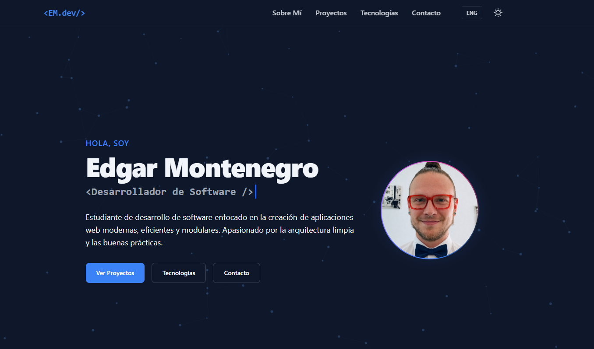
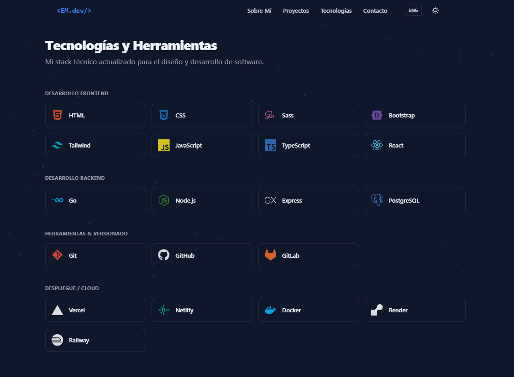
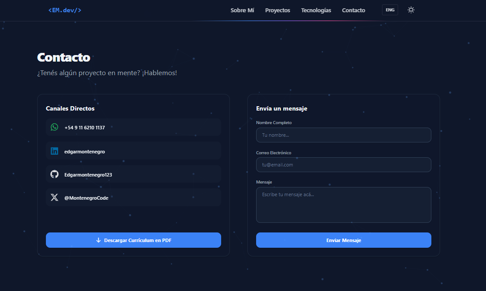

# Portfolio Personal - Edgar Montenegro

Un portfolio profesional, moderno y optimizado para mostrar mis capacidades como desarrollador de software. El proyecto está enfocado en una arquitectura modular, buenas prácticas y una excelente experiencia de usuario (UX).

## 🚀 Características principales
- **Diseño Responsivo:** Adaptado completamente a dispositivos móviles y escritorio.
- **Modo Oscuro/Claro:** Implementación de temas para mayor confort visual.
- **Internacionalización (i18n):** Soporte bilingüe (Español/Inglés).
- **Stack Tecnológico:** Desarrollado con React, TypeScript y Tailwind CSS.

## 📸 Vista Previa

| Hero Section |              Skills              |            Contact             |
| :---: |:--------------------------------:|:------------------------------:|
|  |  |  |

## 🛠 Tecnologías
- [React](https://react.dev/)
- [TypeScript](https://www.typescriptlang.org/)
- [Tailwind CSS](https://tailwindcss.com/)

## 💻 Instalación
1. Clona el repositorio: `git clone https://github.com/Edgarmontenegro123/tu-repo.git`
2. Instala dependencias: `npm install`
3. Inicia el servidor: `npm run dev`

## 📬 Contacto
- **LinkedIn:** [linkedin.com/in/edgarmontenegro](https://www.linkedin.com/in/edgarmontenegro/)
- **Email:** edgarmontenegro321@gmail.com